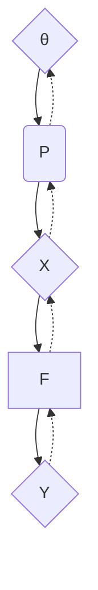

---
tags:
  - "#clblogs"
  - clwip
---
# Motivation
>[!quote] [Wikipedia](https://en.wikipedia.org/wiki/Reparameterization_trick)
>>  The reparameterization trick allows for the efficient computation of gradients through random variables, enabling the optimization of [parametric probability models](https://en.wikipedia.org/wiki/Parametric_model "Parametric model") using [stochastic gradient descent](https://en.wikipedia.org/wiki/Stochastic_gradient_descent "Stochastic gradient descent")

Consider a function of the form:

$$
L(\theta) = \mathbb{E}_{X \sim P_\theta}[F(X)]
$$
>[!info]
>>Our goal is to answer the question: How can we compute $\nabla_{\theta} L(\theta)$? 

Before calculating $\nabla_{\theta} L(\theta)$, let's discuss how to calculate $L(\theta)$. We can use Monte Carlo methods to estimate the [expectation](Posts/Math/Expected%20value%20and%20variance.md) by repeatedly sampling $x \sim P_{\theta}$, calculating $Y=F(X)$, and then averaging all $Y$:

$$
\begin{align}
L(\theta) &\approx \frac{1}{n} \sum_{i=1}^{n} Y_i \\
\text{where} \quad Y_i &= F(X_i) , \quad X_i \sim P_\theta
\end{align}
$$

The following is the computational graph that describes how to generate a single sample $Y$ from the parameters $\theta$.

The shape and style of nodes/edges define their semantics:
- Diamond nodes represent data ($\theta,X,Y$), and act as the input/output of functions.
- Rounded boxes represent stochastic functions ($P_{\theta}$)
- Rectangular boxes represent deterministic functions ($F$):
- Full arrows show the direction data flows for generating a sample $Y$ based on parameters $\theta$.
- The dashed arrows show the direction that gradients flow when differentiating the output $Y$ with respect to the parameters $\theta$.

The computational graph makes it clear how to calculate $\nabla_{\theta} L$: We simple accumulate the gradients along the dashed arrows. However, an issue arises since we need to differentiate through a stochastic function $P_{\theta}$, which is not well-defined. 

We discuss two options for handling this: the REINFORCE estimator, and the reparameterization trick.
# REINFORCE Estimator
The REINFORCE estimator uses the log-derivative trick to rewrite $\nabla_{\theta} L(\theta)$ as an expectation that we can calculate directly:

$$
\begin{align}
\nabla_{\theta} L(\theta) &= \nabla_{\theta} \mathbb{E}_{x \sim P_\theta}[f(x)] \\
&= \nabla_{\theta} \sum_{x} P_{\theta}(x) f(x) \quad \text{(Def. of Expectation)} \\
&= \sum_{x} \nabla_{\theta}( P_{\theta}(x) f(x)) \quad \text{(Linearity of Expectation)} \\
&= \sum_{x}   f(x) \nabla_{\theta}P_{\theta}(x) + P_\theta(x)\nabla_{\theta}f(x) \quad \text{(Product rule)} \\
&= \sum_{x} f(x) \nabla_{\theta}P_{\theta}(x)  \quad (f \text{ does not depend on } \theta) \\
&= \sum_{x} f(x) P_\theta(x)\nabla_{\theta}\log P_{\theta}(x)  \quad (\text{Log-derivative trick}) \\
&= \mathbb{E}_{x \sim P_{\theta}}[f(x) \nabla_{\theta}\log P_\theta(x)]
\end{align}
$$

This final expression is called the REINFORCE estimator for $\nabla_{\theta} L(\theta)$. Similar to how we approximated $L(\theta)$, we can approximate this expectation by sampling $X \sim P_{\theta}$ and averaging $f(x) \nabla_{\theta}\log P_\theta(x)$. One issue with this estimator is that it has high variance since it involves multiplying $f(x)$ and  $\nabla_{\theta}\log P_\theta(x)$. 

Instead of using the high-variance REINFORCE estimator, we can use the reparameterization trick.

# Reparameterization trick
# References
- [REINFORCE vs Reparameterization Trick](https://stillbreeze.github.io/REINFORCE-vs-Reparameterization-trick/)